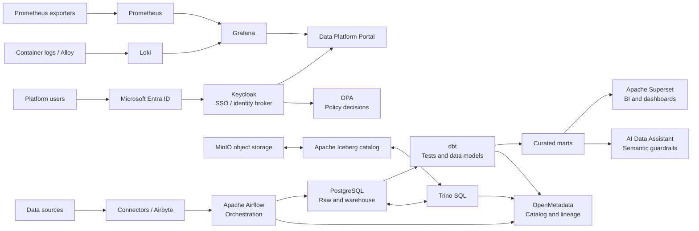

<div align="center">
  
</div>

<h1 align="center">Open Source Data Platform</h1>

<p align="center">A self-hosted, modular data platform for turning operational data into governed, observable, and consumable data products.</p>

<p align="center"><a href="README.vi.md">Tiếng Việt</a> · <a href="docs/roadmap.md">Roadmap</a> · <a href="#tool-guides">Tool guides</a></p>


## Purpose

Open Source Data Platform provides a single Local Lab for the complete data-product lifecycle: connect to sources, land and model data, query it across warehouse and lakehouse storage, publish analytics, govern access, and operate the platform from measurable signals.

The design is modular: each capability is independently documented and runs behind a Docker Compose profile. This makes the lab useful for development, demonstrations, integration testing, and progressive adoption.

## Architecture



## Local Lab quick start

### 1. Prerequisites

- Docker Desktop with at least 8 GB memory allocated.
- Docker Compose v2.
- Git and PowerShell on Windows.

### 2. Create local configuration

```powershell
Copy-Item .env.example .env
```

Set strong local passwords in `.env`. To enable the Entra broker, fill `AZURE_TENANT_ID`, `AZURE_CLIENT_ID`, and `AZURE_CLIENT_SECRET`; the values are never committed.

In the Microsoft Entra application registration, add this redirect URI before first login:

```text
http://localhost:8180/realms/open-source-data-platform/broker/azure-entra/endpoint
```

Use your DNS hostname instead of `localhost` when the lab is accessed from another machine.

### 3. Start the complete Local Lab

```powershell
docker compose --env-file .env -f infra/docker-compose/docker-compose.local.yml `
  --profile portal --profile analytics --profile orchestration `
  --profile observability --profile lakehouse --profile governance --profile ai `
  up -d --build
```

The one-time database, Superset, Airflow, MinIO, and Entra configuration jobs may take a few minutes. Check progress with:

```powershell
docker compose --env-file .env -f infra/docker-compose/docker-compose.local.yml ps
docker compose --env-file .env -f infra/docker-compose/docker-compose.local.yml logs --tail=100 keycloak-entra-config trino
```

### 4. Open the applications

| Application | Local address |
| --- | --- |
| Data Platform Portal | http://localhost:3000 |
| Airbyte | http://localhost:8001 |
| Airflow | http://localhost:8080 |
| Superset | http://localhost:8088 |
| Grafana | http://localhost:3001 |
| Prometheus | http://localhost:9090 |
| MinIO Console | http://localhost:9001 |
| Trino | http://localhost:8081 |
| Iceberg REST catalog | http://localhost:8181/v1/config |
| OpenMetadata | http://localhost:8585 |
| Keycloak | http://localhost:8180 |
| OPA health | http://localhost:8182/health |
| AI Data Assistant health | http://localhost:8010/health |

### 5. Verify data services

```powershell
docker compose --env-file .env -f infra/docker-compose/docker-compose.local.yml exec postgres `
  psql -U platform_admin -d dwh -c "select current_database(), now();"

docker compose --env-file .env -f infra/docker-compose/docker-compose.local.yml exec -T trino `
  trino --execute "SHOW CATALOGS"

docker compose --env-file .env -f infra/docker-compose/docker-compose.local.yml --profile tools run --rm dbt test

& "$env:USERPROFILE\go\bin\abctl.exe" local status
docker compose --project-name open-source-data-platform-openmetadata `
  -f .runtime\openmetadata\docker-compose.yml ps
```

### 6. Stop the lab

```powershell
docker compose --env-file .env -f infra/docker-compose/docker-compose.local.yml down
```

`down` stops containers while retaining named volumes. Do not add `--volumes` unless you explicitly intend to remove local platform data.

## Tool guides

Each guide is available in English below and in [Vietnamese](docs/tools/vi/).

| Capability | Guide |
| --- | --- |
| Source ingestion and Airbyte | [Airbyte](docs/tools/airbyte.md) · [Connector framework](docs/tools/ingestion.md) |
| Orchestration | [Apache Airflow](docs/tools/airflow.md) |
| Modeling and quality | [dbt](docs/tools/dbt.md) |
| Warehouse | [PostgreSQL](docs/tools/postgresql.md) |
| Analytics | [Apache Superset](docs/tools/superset.md) |
| Object storage and lakehouse | [MinIO](docs/tools/minio.md) · [Apache Iceberg](docs/tools/iceberg.md) · [Trino](docs/tools/trino.md) |
| Identity and policies | [Keycloak and Entra SSO](docs/tools/keycloak.md) · [OPA](docs/tools/opa.md) |
| Observability | [Prometheus](docs/tools/prometheus.md) · [Grafana](docs/tools/grafana.md) · [Loki and Alloy](docs/tools/loki.md) |
| Catalog and lineage | [OpenMetadata](docs/tools/openmetadata.md) |
| Platform entry point | [Portal](docs/tools/portal.md) |
| Safe natural-language querying | [AI Data Assistant](docs/tools/ai-assistant.md) |

## Security notes

- Keep `.env`, credentials, tokens, certificates, and exported datasets out of Git.
- The Local Lab is intentionally single-host and development-oriented. It is not an HA, backup/DR, or production deployment.
- Portal status probes are convenience checks, not an authorization boundary. Use Keycloak, Entra, OPA, network controls, and application-level authorization for shared environments.

For delivery sequencing, scope, and production evolution, see the dedicated [roadmap](docs/roadmap.md).
