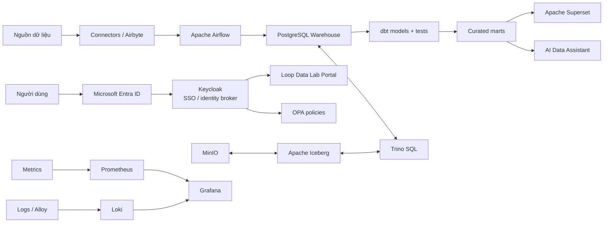
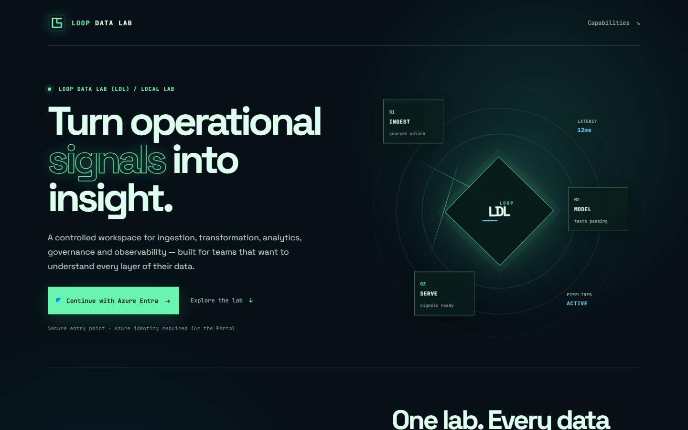
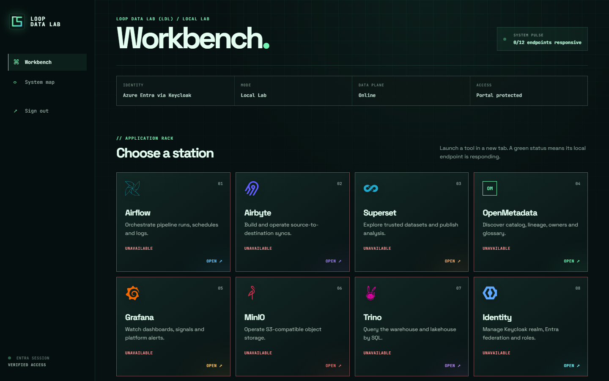

<div align="center">
  
</div>

<h1 align="center">Loop Data Lab (LDL)</h1>

<p align="center">Nền tảng dữ liệu tự triển khai, theo kiến trúc mô-đun, biến dữ liệu vận hành thành data product có quản trị và giám sát.</p>

<p align="center"><a href="README.md">English</a> · <a href="docs/roadmap.md">Lộ trình</a> · <a href="#tai-lieu-tung-cong-cu">Hướng dẫn công cụ</a></p>


## Mục đích nền tảng

Loop Data Lab (LDL) cung cấp Local Lab cho toàn bộ vòng đời data product: kết nối nguồn, lưu dữ liệu, biến đổi và kiểm thử, truy vấn warehouse/lakehouse, xuất bản phân tích, quản trị quyền truy cập, và giám sát vận hành.

Mỗi năng lực chạy trong Docker Compose profile riêng và có tài liệu độc lập; phù hợp cho phát triển, demo, kiểm thử tích hợp và mở rộng dần.

## Kiến trúc



## Hành trình sản phẩm

<p align="center">
  
</p>

<p align="center">
  
</p>

Luồng sử dụng là **Landing page → Azure Entra sign-in → Workbench được bảo vệ → application station**. Trạng thái health của ứng dụng là dữ liệu live nên có thể khác ảnh giao diện tham chiếu.

## Demo Maximo trong 5 phút

Use case tham chiếu của LDL là bảo trì Maximo, không phải một domain E-commerce
không liên quan. Fixture local deterministic được chuẩn hóa bởi cùng connector
với Maximo API thực, sau đó chạy qua Airflow và dbt.

```text
Maximo work orders → raw.maximo_workorder → dbt core/mart models
→ Trino / Superset / AI Assistant
```

```powershell
.\scripts\demo-up.ps1 -Workorders 1000 -SkipAirbyte -SkipOpenMetadata
```

Lệnh tạo fixture, khởi động Compose, trigger `maximo_dbt_pipeline`, chờ các
quality gate dbt và in URL ứng dụng. Với nguồn tích hợp thật, cấu hình các biến
HTTPS `MAXIMO_*` thay vì fixture mode. Xem [hướng dẫn demo Maximo](examples/maximo/README.md).

## Chạy đầy đủ Local Lab

### 1. Điều kiện cần

- Docker Desktop với tối thiểu 8 GB RAM phân bổ cho Docker.
- Docker Compose v2, Git và PowerShell.

### 2. Tạo cấu hình local

```powershell
Copy-Item .env.example .env
```

Đổi các mật khẩu mẫu trong `.env`. Để bật Azure SSO, điền `AZURE_TENANT_ID`, `AZURE_CLIENT_ID`, `AZURE_CLIENT_SECRET` đã được cấp.

Trong Microsoft Entra App Registration, thêm Redirect URI này trước khi đăng nhập:

```text
http://localhost:8180/realms/open-source-data-platform/broker/azure-entra/endpoint
```

Nếu chạy bằng hostname hoặc từ máy khác, thay `localhost` bằng hostname thực tế và đăng ký đúng URI đó trong Entra.

### 3. Khởi động toàn bộ nền tảng

```powershell
.\scripts\start-local-lab.ps1
```

Script điều phối các profile Docker Compose chính, runtime Airbyte `abctl`/Kind riêng và OpenMetadata Compose riêng. Trên máy mới, cài tự động `abctl` của Airbyte bằng:

```powershell
.\scripts\start-local-lab.ps1 -InstallAirbyte
```

Lần tải OpenMetadata đầu tiên và các job database, Superset, Airflow, MinIO, Entra có thể mất vài phút. Nếu Docker Desktop thiếu tài nguyên, chạy platform chính trước với `-SkipAirbyte -SkipOpenMetadata`. `-Initialize` tạo `.env` còn thiếu từ template rồi dừng để bạn cấu hình an toàn; `-Restart` khởi động lại Compose chính nhưng vẫn giữ volumes.

### 4. Mở ứng dụng

`http://localhost:3000/` là landing page Loop Data Lab công khai. Chọn **Continue with Azure Entra** để vào Portal được bảo vệ; truy cập trực tiếp `/portal/` cũng khởi động đúng luồng Azure. Các ứng dụng còn lại vẫn dùng đăng nhập riêng cho đến khi được cấu hình native Keycloak OIDC.

| Ứng dụng | Địa chỉ local |
| --- | --- |
| Loop Data Lab Portal | http://localhost:3000 |
| Airbyte | http://localhost:8001 |
| Airflow | http://localhost:8080 |
| Superset | http://localhost:8088 |
| Grafana | http://localhost:3001 |
| Prometheus | http://localhost:9090 |
| MinIO Console | http://localhost:9001 |
| Trino | http://localhost:8081 |
| OpenMetadata | http://localhost:8585 |
| Keycloak | http://localhost:8180 |
| OPA health | http://localhost:8182/health |
| AI Assistant health | http://localhost:8010/health |

### 5. Xác minh

```powershell
docker compose --env-file .env -f infra/docker-compose/docker-compose.local.yml exec postgres `
  psql -U platform_admin -d dwh -c "select current_database(), now();"

docker compose --env-file .env -f infra/docker-compose/docker-compose.local.yml exec -T trino `
  trino --execute "SHOW CATALOGS"

docker compose --env-file .env -f infra/docker-compose/docker-compose.local.yml --profile tools run --rm dbt test

& "$env:USERPROFILE\go\bin\abctl.exe" local status
docker compose --project-name open-source-data-platform-openmetadata `
  -f .runtime\openmetadata\docker-compose.yml ps
```

### 6. Dừng Local Lab

```powershell
docker compose --env-file .env -f infra/docker-compose/docker-compose.local.yml down
```

Lệnh này chỉ dừng Compose project chính và giữ named volumes. Airbyte và OpenMetadata có runtime riêng, xem hướng dẫn từng công cụ để dừng chúng. Không thêm `--volumes` nếu chưa chủ động muốn xóa dữ liệu local.

## Tài liệu từng công cụ

Mỗi hướng dẫn dưới đây có bản tiếng Anh tương ứng tại [docs/tools](docs/tools/).

| Nhóm năng lực | Hướng dẫn |
| --- | --- |
| Ingestion | [Airbyte](docs/tools/vi/airbyte.md) · [Khung connector](docs/tools/vi/ingestion.md) |
| Orchestration | [Apache Airflow](docs/tools/vi/airflow.md) |
| Transformation | [dbt](docs/tools/vi/dbt.md) |
| Warehouse & BI | [PostgreSQL](docs/tools/vi/postgresql.md) · [Superset](docs/tools/vi/superset.md) |
| Lakehouse | [MinIO](docs/tools/vi/minio.md) · [Iceberg](docs/tools/vi/iceberg.md) · [Trino](docs/tools/vi/trino.md) |
| Identity & policy | [Keycloak và Entra SSO](docs/tools/vi/keycloak.md) · [OPA](docs/tools/vi/opa.md) |
| Observability | [Prometheus](docs/tools/vi/prometheus.md) · [Grafana](docs/tools/vi/grafana.md) · [Loki và Alloy](docs/tools/vi/loki.md) |
| Catalog & lineage | [OpenMetadata](docs/tools/vi/openmetadata.md) |
| Portal & AI | [Portal](docs/tools/vi/portal.md) · [AI Data Assistant](docs/tools/vi/ai-assistant.md) |

## Lưu ý bảo mật

- Không commit `.env`, secrets, token, certificate hay dữ liệu export.
- Local Lab là môi trường single-host cho phát triển; không phải cấu hình HA, backup/DR hay production.
- Health check Portal không thay thế xác thực. Môi trường dùng chung cần Keycloak, Entra, OPA, giới hạn mạng và authorization trong từng ứng dụng.

Xem [roadmap riêng](docs/roadmap.md) để biết thứ tự triển khai, tiêu chí hoàn thiện và hướng phát triển môi trường dùng chung.
